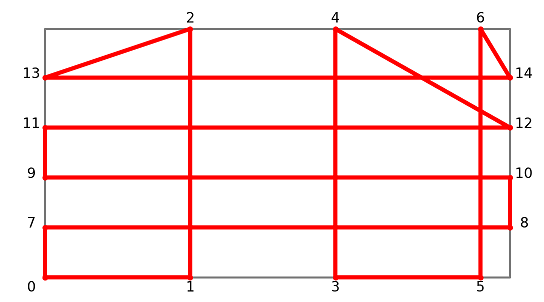

# Minimizing the cycle lengh of a glass cutting machine

This repo contains the instances used on a research paper on the Cutting Path Optimization Problem, as well as the code used to generate these instances. The paper is currently under revision. Here is the abstract:

"We study the problem of determining a minimum length cycle for a glass cutting machine used to create vertical and horizontal scores on rectangular glass plates. We show that the problem can be modeled as a Traveling Salesman Problem (TSP) and as a Rural Postman Problem (RPP) using the same graph. Some specific features of the problem make the formulation using the RPP approach equivalent to the TSP formulation if a certain type of subtour elimination constraint is used. Computational results performed in a large set of instances indicate that the time necessary to solve an instance is related to the size of the graph and to whether the number of vertical and horizontal lines in the cutting pattern is odd or even."

The code generates graphs based on vertical and horizontal scores that a glass cutting machine must create on rectangular plates in one of the manufacturing processes of automotive glass. The tool head of the cutting machine starts and finished its cycle at a certain position and travels from one point to another in straight lines. For example the following figure shows an optimal path starting and ending at node zero (0 → 1 → 2 → 13 → 14 → 6 → 5 → 3 → 4 → 12 → 11 → 9 → 10 → 8 → 7 → 0). In this example, the scores that were performed by the cutting tool are the vertical lines 1—2, 3—4, 5—6 and the horizontal lines 7—8, 9—10, 11—12, 13—14.

More details about the instances are available at [http://dx.doi.org/10.17632/8jyf6s695p.1](http://dx.doi.org/10.17632/8jyf6s695p.1) (in Portuguese).
